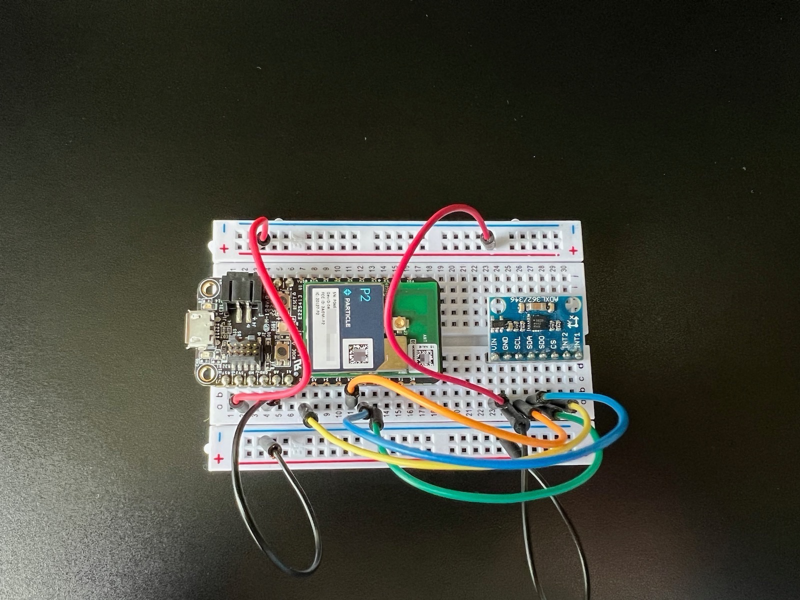

# smart lifebuoy blueprint

This project illustrates gesture detection using an accelerometer. It's pre-programmed to detect:

- Idle
- Waving side to side
- Bobbing up and down
- Moving like a snake

This could be the basis for a smart lifebuoy that can detect how it's being used! 

## To use in Particle Workbench

1. In Workbench, select **Particle: Import Project** and select the `project.properties` file 

1. Use **Particle: Configure Project for Device** and select the platform such as **P2** and the latest 5.x or 6.x release.

1. Compile with  **Particle: Compile application (local)**

1. Flash with **Particle: Flash application (local)**

> At this time you cannot use the **Particle: Cloud Compile** or **Particle: Cloud Flash** options; local compilation is required.

## Overview

This solution is designed for Particle devices like the Photon 2, Boron, and M-SoM.

## Key Features

- **Edge Impulse Integration**: Uses Edge Impulse's machine learning capabilities to train a model for your own gestures.
- **Seamless Deployment**: Supports Particle devices such as the Photon 2, Boron, and M-SoM, enabling efficient edge processing.
- **Versatile Applications**: Suitable for applications such as smart home systems.

## Prerequisites

To complete this project, you will need:

1. **Particle Device**: Photon 2, Boron, or M-SoM.
   - [Purchase here](https://store.particle.io/collections/all-products?filter.p.product_type=Development%20Boards)
2. **Accelerometer**. This project uses an ADXL 
3. **Edge Impulse Account**: Sign up at [Edge Impulse](https://www.edgeimpulse.com/) to train the model.

## Table of Contents

- [Overview](#overview)
- [Key Features](#key-features)
- [Prerequisites](#prerequisites)
- [Setup Steps](#setup-steps)
  - [1. Configure the Hardware](#1-configure-the-hardware)
  - [2. Collect Training Data](#2-collect-training-data)
  - [3. Train the Model on Edge Impulse](#3-train-the-model-on-edge-impulse)
  - [4. Deploy the Model to Particle](#4-deploy-the-model-to-particle)
  - [5. Test and Fine-Tune](#5-test-and-fine-tune)
- [Conclusion](#conclusion)

## Setup Steps

### 1. Configure the Hardware

1. Connect accelerometer to your Particle device (Photon 2, Boron, or M-SoM).

| Breakout | Particle Device | Color | Description |
| :---: | :---: | :---: | :---: |
| VIN  | 3V3 | Red | 3.3V DC Power |
| GND  | GND | Black | Ground |
| SCL / SCLK  | Orange | SPI CLK |
| SDA / MOSI / SDI  | Blue | SPI MOSI |
| SDO / MISO |  Green | SPI MISO |
| CS   | A2 | Yellow | SPI Chip Select |
| INT2 | n/c | | Interrupt 2 (not used) |
| INT1 | n/c | | Interrupt 1 (not used) |

2. Set up your Particle device in the Particle Console to ensure it’s online and ready to transmit data.

## To update this project

### 1. Collect Training Data 

1. **Log into Edge Impulse** and create a new project for gesture detection.
2. Go to the **Data Acquisition** tab and collect sample data for the words you wish to detect. If you are generating your own audio sample data,
you can generate samples using your phone, which is often easier than getting the raw samples off your Particle device.

### 2. Train the Model on Edge Impulse

1. In Edge Impulse, go to **Create Impulse** and select a suitable **Signal Processing Block** (e.g., Spectral Analysis) for audio or vibration data.
2. Add a **Learning Block** for classification.
3. Go to the **Training** tab, configure training parameters, and start training the model.
4. Monitor the training results to ensure high accuracy in distinguishing running water sounds.

### 3. Deploy the Model to Particle

1. Once the model is trained, go to the **Deployment** tab in Edge Impulse.
2. Export the model as a C++ library or a Particle-compatible model file.
3. Upload the model to your Particle device using the Particle CLI or Web IDE.
4. Configure the device firmware to run the model and classify data from the sensor.

### 4. Test and Fine-Tune

1. Deploy the Particle firmware and begin testing the device in real-world conditions.
2. Use the **Edge Impulse Live Classification** feature to validate model accuracy.
3. Fine-tune the model as needed by collecting additional data or adjusting training parameters.
